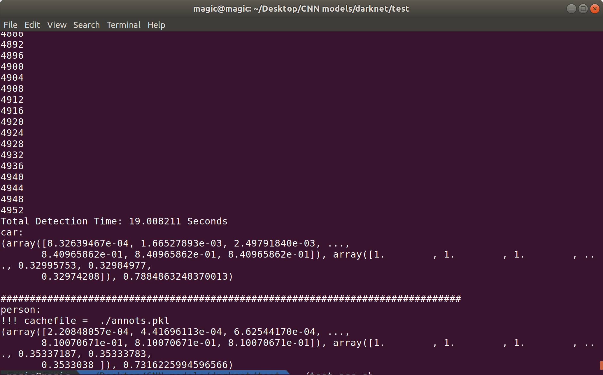

# 验证yolov3自训练权重的mAp说明
---
   1. 将所有文件放在darknet根目录
   2. 修改darknet/examples/detector.c文件，搜索comp4_det_test_，将两个 if(!outfile) outfile = "comp4_det_test_"; 修改成if(!outfile) outfile ="";
   3. 直接运行test-acc.sh，（运行前可能需要给予权限，chmod +x test-acc.sh)
   4. 会在results文件件下生成所评估的类文件，eg：我的时car和person

 
 5. 0.788 和 0.731 分别时车和人的mAp